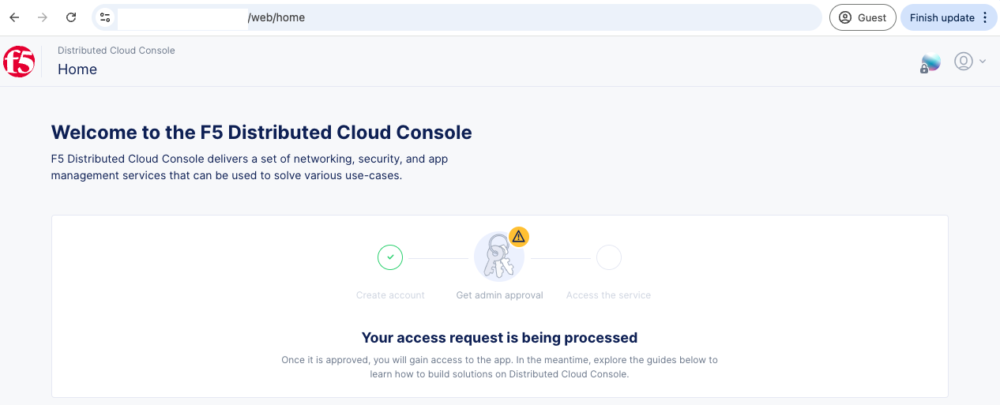
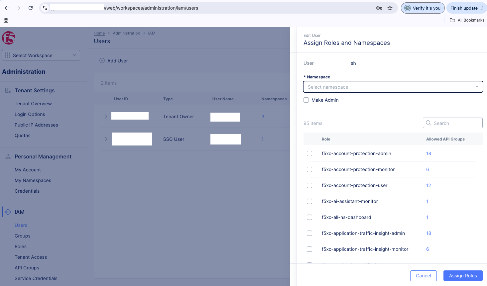
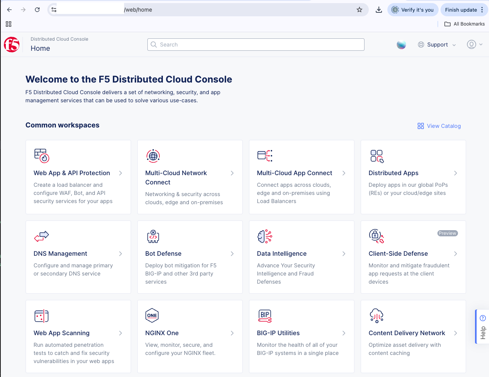
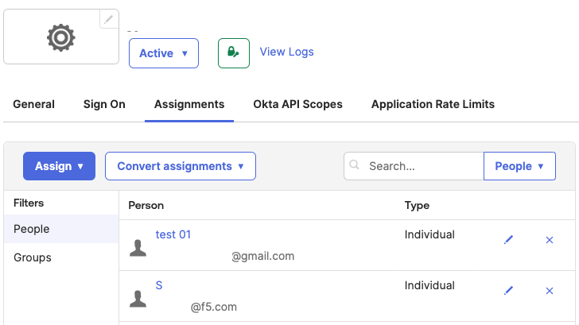

# f5xc-role-ns-cfg
Example of assigning roles and namespaces for SSO users who require a tenant owner(TO)'s approval via F5 Distributed Cloud's Public API for your automation without TO's manual configuration via UI.

| 1. Unapproved SSO users | 2. Tenant owners manual approval | 3. Approved SSO users |
|----------------------|-------------------------------|--------------------|
|  |  |  |


## Step 1. Prerequisites
- **Clone** this repo.
  ```bash
  git clone https://github.com/f5devcentral/f5xc-role-ns-cfg
  ```
- **Sign-in** as a tenant owner.
- [Generate API Tokens for My Credentials.](https://docs.cloud.f5.com/docs-v2/administration/how-tos/user-mgmt/Credentials#generate-api-tokens-for-my-credentials)
- Assign SSO users in the client application in your IdP as the following example:
  


## Step 2. Set Environment Variables
- Open [.env](.env) file.
- Edit the following values per environment variable.
  | Env Variable | Description |
  |--------------|-------------|
  | `API_KEY`    | API token you generated with [this doc](https://docs.cloud.f5.com/docs-v2/administration/how-tos/user-mgmt/Credentials#generate-api-tokens-for-my-credentials) |
  | `XC_FQDN`    | F5 Distributed Cloud's Fully Qualified Domain Name (e.g., `mytenant.console.ves.volterra.io`) |


## Step 3. Configuring Roles and Namespaces
- Have list of roles and namespaces
- **Assign** user roles and namespaces
  ```bash
  bash xc-roles-ns-assign.sh <API payload file>
  ```
  > Payload example: [01_assign_user_roles_user_1.json](./01_assign_user_roles_user_1.json)
  ```json
  {
    "name": "<enter-email@address>",
    "namespace": "system",
    "type": "USER",
    "first_name": "Test",
    "last_name": "01",
    "email": "<enter-email@address>",
    "idm_type": "SSO",
    "namespace_roles": [
        { "namespace": "system", "role": "f5xc-ddos-transit-services-admin"   },
        { "namespace": "system", "role": "f5xc-ddos-transit-services-monitor" },
        { "namespace": "system", "role": "f5xc-ddos-transit-services-user"    }
    ],
    "group_names": []
  }
  ```

- **Delete** user roles and namespaces
  ```bash
  bash xc-roles-ns-delete.sh <API payload file>
  ```
  > Payload example: [02_delete_user_roles_user_1.json](./02_delete_user_roles_user_1.json)
  ```json
  {
    "name": "<enter-email@address>",
    "namespace": "system",
    "type": "USER",
    "first_name": "Test",
    "last_name": "01",
    "email": "<enter-email@address>",
    "idm_type": "SSO",
    "namespace_roles": [],
    "group_names": []
  }
  ```

- **Get** user roles and namespaces
  ```bash
  bash xc-roles-ns-get.sh
  ```
  > Response Example:
  ```json
  {
    "items": [
        {
            "namespace": "system",
            "name": "blahblah@f5.com",
            "email": "blahblah@f5.com",
            "first_name": "Blah",
            "last_name": "Blah",
            "type": "USER",
            "namespace_roles": [
                { "namespace": "shared", "role": "ves-io-admin-role"        },
                { "namespace": "*"     , "role": "ves-io-admin-role"        },
                { "namespace": "system", "role": "ves-io-tenant-owner-role" },
                { "namespace": "system", "role": "ves-io-admin-role"        }
            ],
            "tenant": "<your-tenant-name>-uvetddox",
            "tenant_type": "ENTERPRISE",
            "idm_type": "VOLTERRA_MANAGED",
            "domain_owner": true,
            "otp_enabled": false,
            "disabled": false,
            "creation_timestamp": "2025-02-11T16:58:42.281839228Z",
            "last_login_timestamp": "2025-02-11T20:56:57.432Z",
            "group_names": [],
            "sync_mode": "SELF"
        },
        {
            "namespace": "system",
            "name": "blah@gmail.com",
            "email": "blah@gmail.com",
            "first_name": "Test",
            "last_name": "01",
            "type": "USER",
            "namespace_roles": [
                { "namespace": "system", "role": "f5xc-ddos-transit-services-admin"   },
                { "namespace": "system", "role": "f5xc-ddos-transit-services-monitor" },
                { "namespace": "system", "role": "f5xc-ddos-transit-services-user"    }
            ],
            "tenant": "<your-tenant-name>-uvetddox",
            "tenant_type": "ENTERPRISE",
            "idm_type": "SSO",
            "domain_owner": false,
            "otp_enabled": false,
            "disabled": false,
            "creation_timestamp": "2025-02-11T20:55:26.481889196Z",
            "last_login_timestamp": "2025-02-11T21:56:32.944Z",
            "group_names": [],
            "sync_mode": "SELF"
        }
    ]
  }  
  ```


## References
- [F5 Distributed Cloud API: Get User with Role Assignment](https://docs.cloud.f5.com/docs-v2/api/user#operation/ves.io.schema.user.CustomAPI.List)
- [F5 Distributed Cloud API: Update User with Role Assignment](https://docs.cloud.f5.com/docs-v2/api/user#operation/ves.io.schema.user.CustomAPI.Replace)
